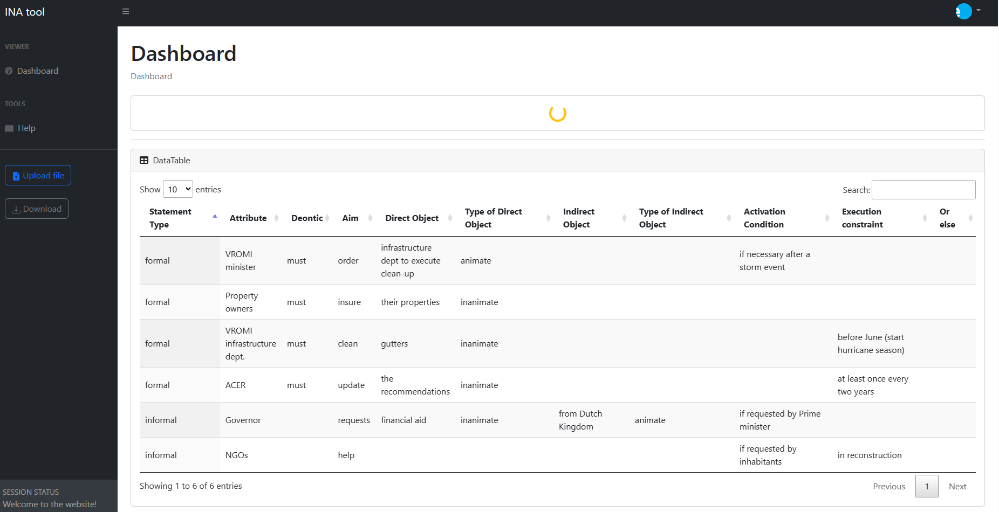

# INA Tool

INA Tool is an open-source digital tool developed by the eScience Center aimed at supporting the regulatory framework design process by facilitating the study, analysis, and decision-making through data visualization and interaction.

## Preview



## Status

[](https://raw.githubusercontent.com/StartBootstrap/startbootstrap-sb-admin/master/LICENSE)

## Download and Installation

This guide will walk you through the installation process for setting up a web application written in JavaScript and PHP using XAMPP.

## Prerequisites

Before starting the installation process, make sure you have the following installed:

- [XAMPP](https://www.apachefriends.org/index.html) - A local development environment that includes Apache, MySQL, PHP, and Perl.
- A modern web browser like Chrome, Firefox, or Safari.

## Installation Steps

1. **Download and Install XAMPP:**
   - Visit the [XAMPP website](https://www.apachefriends.org/index.html) and download the appropriate version for your operating system (Windows, macOS, or Linux).
   - Follow the installation instructions provided on the website or in the downloaded package.

2. **Start XAMPP:**
   - Once installed, start the XAMPP control panel.
   - Start the Apache service by clicking on the 'Start' buttons next to them (MySQL is not needed in the current version).

3. **Clone the Repository:**
   - Clone the repository of your web application from GitHub to your local machine using the following command in your terminal or command prompt:
     ```
     git clone <https://github.com/ESI-FAR/INA-tool.git>
     ```
   
4. **Move Files to XAMPP's `htdocs` Directory:**
   - Locate the `htdocs` directory within your XAMPP installation directory.
   - Move all the files and folders of your web application into the `htdocs` directory.

5. **Access Your Web App:**
   - Open your web browser and navigate to `http://localhost/` followed by the directory where your web application files are located (e.g. http://localhost/INA/).
   - You should now be able to access and interact with your web application.

### Dev container

If you are using Visual Studio Code, you can use the dev container to run the application. The dev container is a pre-configured environment that includes all the necessary tools and dependencies to run the application.

When repository is opened in a devcontainer the website is running on http://localhost:8080 .
Any changes to non-php code requires running `npm run build` to update the website.

## Troubleshooting

- If you encounter any issues during the installation process, refer to the [XAMPP documentation](https://www.apachefriends.org/documentation.html) or search for solutions online.
- Ensure that Apache service is running in the XAMPP control panel.


## Conclusion

Congratulations! You have successfully installed and set up the INA web application using XAMPP. You can now start developing and testing your application locally.

## Usage

### Basic Usage

work in progress...


### Advanced Usage

work in progress...

## Bugs and Issues

Have a bug or an issue with this software? [Open a new issue](https://github.com/ESI-FAR/INA-tool/issues) here on GitHub or drop a message to us.


## Copyright and License

work in progress...
