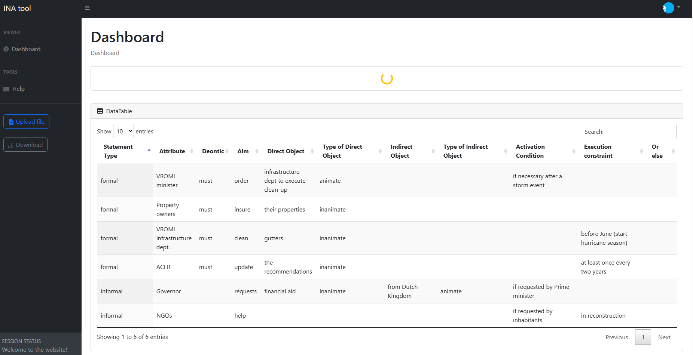

# [INA Tool]

INA Tool is an open source digital tool developed by the eScience Center aimed at supporting of the regulatory framework design process by facilitating study, analysis, and decision-making through data visualization and interaction.

## Preview

## Status

## Download and Installation

To begin using this software, choose one of the following options to get started:

## Usage

### Basic Usage

work in progress...

### Advanced Usage

work in progress...

## Bugs and Issues

Have a bug or an issue with this software? [Open a new issue](https://github.com/ESI-FAR/INA-tool/issues) here on GitHub or drop a message to us.

## Copyright and License

work in progress
