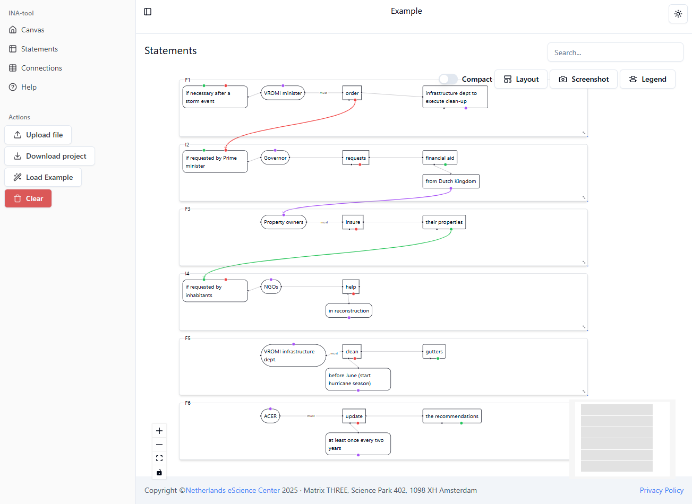

# INA Tool

[](https://raw.githubusercontent.com/StartBootstrap/startbootstrap-sb-admin/master/LICENSE)

INA Tool is an open-source digital tool developed by the eScience Center aimed at supporting the regulatory framework design process by facilitating the study, analysis, and decision-making through data visualization and interaction.

The web application is running at [https://esi-far.github.io/INA-tool/](https://esi-far.github.io/INA-tool/).



## Development

You need [Node.js](https://nodejs.org) >=22 or equivalent to develop the application.

```shell
# To install dependencies
npm install
# To run development server
# Will print the URL to open in the browser
npm run dev
# To build the application,
# after build host generated dist/ directory on a web server
npm run build
# To preview the production build
# Will print the URL to open in the browser
npm run preview
# To format
npm run format
# To lint
npm run lint
# To type check
npm run typecheck
# To run tests, tests are written with vitest and are named `*.test.ts[x]`.
npm run test
```

The application is built with

- [TypeScript](https://www.typescriptlang.org/) as programming language
- [React](https://reactjs.org/) for user interface
- [Vite](https://vitejs.dev/) as build tool
- [Tailwind CSS](https://tailwindcss.com/) for styling
- [React Flow](https://reactflow.dev/) for graph visualization/editing
- [Shadcn/ui](https://ui.shadcn.com/) as component library
- [XSLX](https://sheetjs.com/) and [d3](https://d3js.org/) for parsing and writing files.
- [Zod](https://zod.dev/) for validation
- [Zustand](https://zustand-demo.pmnd.rs/) for state management
- [Prettier](https://prettier.io/) for code formatting
- [ESLint](https://eslint.org/) for linting
- [Vitest](https://vitest.dev/) for unit testing

## Bugs and Issues

Have a bug or an issue with this software? [Open a new issue](https://github.com/ESI-FAR/INA-tool/issues) here on GitHub or drop a message to us.

## AI Disclaimer

The documentation/software code in this repository has been partly generated and/or refined using
GitHub CoPilot. All AI-output has been verified for correctness,
accuracy and completeness, adapted where needed, and approved by the author.
